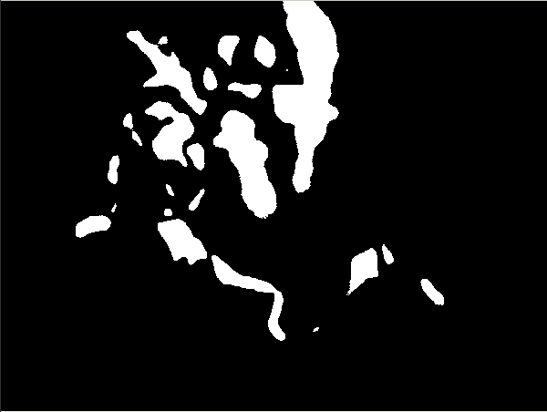
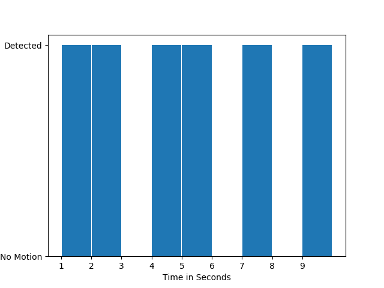

# Real-Time Motion Detection via camera

### How it works
The Idea is to take frame as a input from a camera, and apply thresholding after subtracting the current and previous frame. 
Result of thresholding can be of the two types, a **completely black image** and a **black image containing some white portion**.
**Completely black image** means there was no motion b/w current and new frame, in contrast **black image containing white 
portion** means there was some motion.
<table align='center'>
<tr align='center'>
<td>Black Image (No Motion)</td>
<td>Black image containing white portion (presence of motion)</td>
</tr>
<tr>
<td>
<td>
</tr>
</table>  

### Requirement
* Python 2.7
* openCV
* matplotlib
### Usage
* After Cloning and navigating to the directory run `python motionDetector.py` in terminal.
* Press Q to Exit.
* After exiting you'll get a motion-graph.  

  

